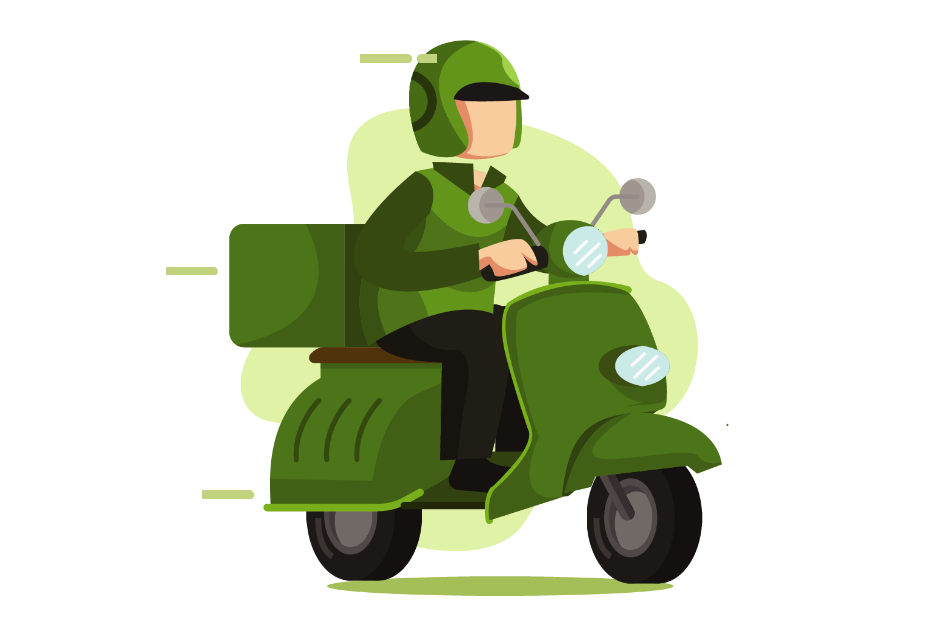

<div align="center">


<br/>

[](https://developer.mozilla.org/pt-BR/docs/Web/HTML)
[](https://developer.mozilla.org/pt-BR/docs/Web/CSS)
[](https://developer.mozilla.org/pt-BR/docs/Web/JavaScript)
[](https://wa.me/)

<br/>

> **BãoDaFeira** é um marketplace que conecta agricultores familiares e produtores rurais diretamente aos consumidores — sem atravessadores, com alimentos mais frescos e preço justo para quem produz e para quem compra.

<br/>

---

</div>

## O Problema

Hoje, um tomate sai da roça, passa por atravessador, distribuidor, atacado e supermercado antes de chegar na sua mesa. Nessa cadeia, o agricultor recebe uma fração mínima do valor final e o consumidor paga caro por um produto que perdeu boa parte do frescor no caminho.

A **agricultura familiar** é responsável por mais de **70% dos alimentos que chegam à mesa dos brasileiros**, mas é justamente o elo que menos ganha nessa cadeia.

---

## A Solução

A **BãoDaFeira** elimina os intermediários. O produtor cadastra seus produtos diretamente na plataforma — com fotos, preços e disponibilidade — e o consumidor encontra, escolhe e entra em contato para combinar a entrega ou retirada. Simples assim.

```
  Produtor  ────────────────────────────►  Consumidor
  cadastra         BãoDaFeira               compra
  seus produtos    (sem intermediários)      direto
```

Mais dinheiro na mão de quem planta. Mais frescor na mesa de quem come.

---

## Números

<div align="center">

| 🌱 Produtores | 🛒 Produtos | 😊 Clientes |
|:---:|:---:|:---:|
| **200+** | **1.200+** | **4.800+** |
| Cadastrados | Frescos disponíveis | Satisfeitos |

</div>

---

## Para Quem é a BãoDaFeira



### 🌾 Para o Produtor Rural

O agricultor finalmente tem um espaço só seu para mostrar o que produz — sem precisar de feira física, sem depender de atravessadores e sem custo de entrada. É só cadastrar, publicar e vender.

- Cria seu perfil e cadastra seus produtos com foto e preço
- Recebe pedidos diretamente pelo WhatsApp
- Gerencia tudo pelo painel do produtor: estoque, pedidos e avaliações
- Constrói sua reputação com avaliações dos clientes

### 🏙️ Para o Consumidor Urbano

Chega de pagar caro por alimento sem história. Na BãoDaFeira você sabe exatamente quem plantou, onde e como — e ainda paga menos do que no supermercado.

- Navega pelo catálogo e filtra por categoria, preço e localização
- Conhece o perfil do produtor antes de comprar
- Adiciona ao carrinho e finaliza o pedido em minutos
- Combina a entrega direto com o produtor pelo WhatsApp

---

## Como Funciona

**3 passos do campo à sua mesa:**

**1. O produtor se cadastra** — cria seu perfil gratuito, conta sua história e publica seus produtos frescos com foto e preço.

**2. O consumidor encontra** — acessa a plataforma, busca o que precisa e descobre produtores da sua região com avaliações reais de outros clientes.

**3. Combinam diretamente** — produtor e consumidor entram em contato pelo WhatsApp e acertam a entrega ou retirada do jeito que for melhor para os dois.

---

## Formas de Pagamento

A plataforma foi pensada para a realidade do campo e da cidade:

| Método | Como funciona |
|---|---|
| 💚 **PIX** | Transferência imediata, prático para ambos os lados |
| 💬 **WhatsApp** | Combinam o pagamento direto na conversa com o produtor |
| 💵 **Dinheiro** | Pago na hora da retirada ou entrega — sem complicação |

---

## Nossa Missão

> *"Reconectar as pessoas com quem produz seu alimento, valorizando o trabalho da agricultura familiar e tornando o acesso a comida de verdade mais justo, fresco e acessível para todos."*

A BãoDaFeira acredita que um sistema alimentar mais saudável começa quando o consumidor conhece o produtor — e que tecnologia pode ser a ponte entre o campo e a cidade.

---

## Impacto Social

- **Para o agricultor:** mais autonomia, preço justo e acesso direto ao mercado consumidor
- **Para o consumidor:** alimentos mais frescos, rastreáveis e com história conhecida
- **Para a comunidade:** fortalecimento da economia local e da agricultura familiar
- **Para o meio ambiente:** menos transporte, menos desperdício, cadeia mais curta

---

<div align="center">

---

Feito para a **agricultura familiar brasileira**

*Conectando o campo à sua mesa — direto, fresco e justo.*

</div>
